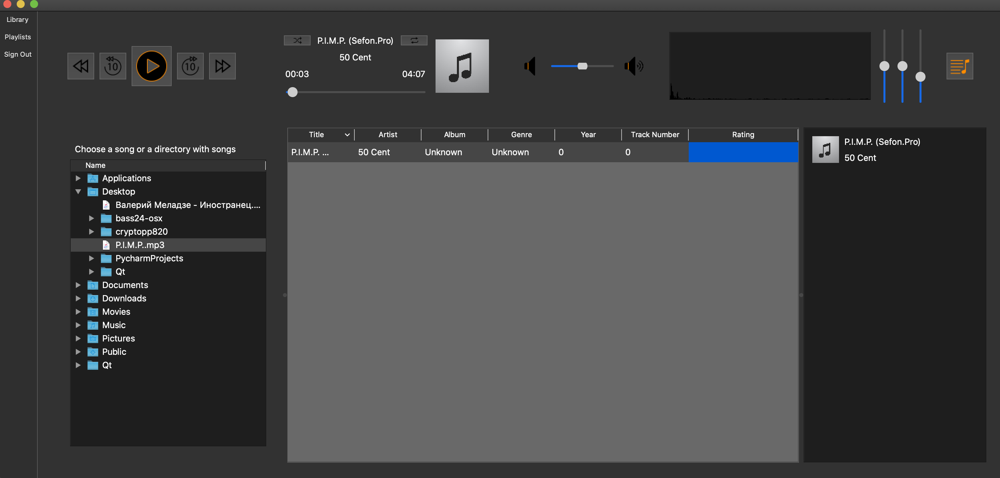

# UAMP
___
​
### Description:
   [UCode](https://ucode.world) project - audioplayer. Contains a music library, playback queue; supports creating, importing and exporting playlists.
   ___
​
 

### Developers:
 [Maxim Libovych](https://github.com/mlibovych)

 [Yulia Bondarenko](https://github.com/kali-y23)

#### 1.Built with
​
 [CMake](https://cmake.org)
 [Bass](https://www.un4seen.com)
​
#### 2.GUI library
​
 [Qt](https://www.qt.io)

### Installation:
    1. git clone --recursive https://github.com/mlibovych/CPP-Uamp
    2. cmake . -Bbuild -Wdev -Werror=dev && cmake --build ./build

### How to use?
    ./uamp

### License
[MIT](https://choosealicense.com/licenses/mit/)

---
